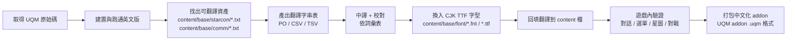

# Star Control II (1992 DOS) 繁體中文化 — 技術分析報告

> **調查目錄**：`Q:\Dos_G\StarControl2\Star Control II (1992)\StarCon2\starcon2`
> **文件性質**：純技術分析（本報告不修改任何原始遊戲檔案）
> **決策前提**：使用者已選定主路線 = **The Ur-Quan Masters（UQM）開源移植版**；本報告同時記錄「1992 DOS 版直改」的可行性作對照。

---

## 目錄

1. [執行摘要](#執行摘要)
2. [檔案結構事實盤點](#檔案結構事實盤點)
3. [文字資產在哪裡：實證結果](#文字資產在哪裡實證結果)
4. [兩條路線比較：DOS 直改 vs UQM 移植](#兩條路線比較dos-直改-vs-uqm-移植)
5. [DOS 1992 版技術挑戰](#dos-1992-版技術挑戰)
6. [推薦路線：UQM 中文化流程](#推薦路線uqm-中文化流程)
7. [翻譯策略與語氣原則](#翻譯策略與語氣原則)
8. [Roadmap（分階段執行）](#roadmap分階段執行)
9. [總結表格](#總結表格)

---

## 執行摘要

Star Control II（1992 DOS）的中文化，**若目標是 1992 DOS 原生執行檔**，屬於高難度的逆向 + 引擎改造專案；主要瓶頸不是文字翻譯而是「8×8 點陣 ASCII 字型」與「Toys For Bob 自製 PKG 封裝」兩件事。**若目標是開源移植版 UQM**，字型/編碼/工具鏈全部具備，翻譯是純內容工作，難度大幅下降到與一般開源 RPG 中文化相同等級。

實測發現三件影響決策的關鍵事實（皆為讀檔驗證，非臆測）：

1. **`.MLE` 是純 ASCII 隊伍檔**：第 1 行隊名 + 14 行 `.SHP` 檔名，CRLF 換行。翻譯無門檻，但 DOS 版顯示需字型引擎改造。
2. **`SETUP.PKG` 內含明文開場與結局旁白（未壓縮 ASCII）**：包含 "There were many great battles..." 完整開場字幕，以及主角回憶結局對白。這是意料之外的好消息 —— 至少 intro/outro 文字資產可直接抽取。
3. **`STARCON2.EXE` 使用 RTLink/Plus overlay**：主程式僅 343KB，內含 `eov0001`、`Overlay Manager Internal Reload Stack` 等 runtime 訊息；大量對話資料極可能位於 overlay 資料段或另一封裝內，抽取需專用工具。

**結論建議**：全案採 UQM 路線；1992 DOS 版檔案作為術語比對與資產參考來源保留。

---

## 檔案結構事實盤點

以下所有欄位皆從實際檔案讀出，**非猜測**。

| 檔名 | 位元組 | 副檔名 | 實測內容 / 用途 |
|---|---:|---|---|
| `STARCON2.EXE` | 342 819 | .EXE | 主程式；RTLink/Plus overlay 架構（含 `eov00xx` overlay runtime 錯誤字串）。啟動時載入其他 PKG。|
| `MELEE.EXE` | 170 177 | .EXE | Super Melee 獨立版執行檔（僅對戰模式）。|
| `KEYS.EXE` | 30 784 | .EXE | 按鍵設定工具。|
| `STARCON2.COM` | 8 154 | .COM | DOS 啟動 stub，設環境變數後 exec 主 EXE。|
| `MELEE.COM` | 8 154 | .COM | Super Melee 啟動 stub。|
| `STARCON.PKG` | 1 434 | .PKG | 極小型 PKG（header `FF FF`）；推測為 overlay 索引。|
| `CON1.PKG` | 2 053 204 | .PKG | **音樂/取樣資料**（實測含 `BASSRUMP.SAM`、`BLSNARE.SAM`、`CASIOSNR.SAM`、`MOBYBUZZ.SAM` 樣本引用、作曲者 `D. Nicholson` 註解）。**無需翻譯**。|
| `CON2.PKG` | 1 443 224 | .PKG | 圖像資料（Bitmap runs 為主）。**含圖形化文字時需重繪，否則無需翻譯**。|
| `IP.PKG` | 947 953 | .PKG | 星際航行（InterPlanetary）畫面圖像資料。|
| `MELEE.PKG` | 67 742 | .PKG | Super Melee 對戰畫面圖像。|
| `SETUP.PKG` | 2 370 872 | .PKG | **含明文遊戲文字**：實測直接讀出整段開場敘事、結局回憶對白、`INTROx.MOD`、`Final Victory Theme` 等字串。翻譯此檔可覆蓋 intro/outro。|
| `100PTS_A.MLE` | 103 | .MLE | Melee 隊伍：Ford's Fighters（100 分）。|
| `100PTS_B.MLE` | 94 | .MLE | Melee 隊伍：Leyland's Lashers（100 分）。|
| `200_PTS.MLE` | 148 | .MLE | Melee 隊伍：The Gregorizers 200。|
| `300_PTS.MLE` | 186 | .MLE | Melee 隊伍：300 point Armada!。|
| `BALANCE1.MLE` | 144 | .MLE | Melee 隊伍：Balanced Battle - Team #1。|
| `BALANCE2.MLE` | 166 | .MLE | Melee 隊伍：Balanced Battle - Team #2。|
| `BEHEMOTH.MLE` | 157 | .MLE | Melee 隊伍：Zenith of the Behemoths。|
| `LILDUDES.MLE` | 114 | .MLE | Melee 隊伍：Little Dudes with Attitudes。|
| `NEW_ALLY.MLE` | 181 | .MLE | Melee 隊伍：New Alliance Ships。|
| `OLD_ALLY.MLE` | 122 | .MLE | Melee 隊伍：Old Alliance Ships。|
| `OLD_HIER.MLE` | 117 | .MLE | Melee 隊伍：Old Hierarchy Ships。|
| `STARCON1.MLE` | 186 | .MLE | Melee 隊伍：Star Control 1 全艦。|
| `STARCON2.MLE` | 183 | .MLE | Melee 隊伍：Star Control 2 全艦。|
| `*.SHP`（25 個）| 36 793–97 521 | .SHP | 星艦圖像 + 遊戲屬性資料（每種族 1 檔）。**內含艦艇/種族名稱**時需檢查，一般不含大段文字。|
| `STARMAP.SAV` | 11 117 | .SAV | 星圖存檔（星系座標、旗艦狀態等二進位資料）。**無需翻譯**。|
| `STARCON2.ICO` | 766 | .ICO | Windows 圖示。無需翻譯。|

### `.MLE` 檔精確格式（實測 hex dump 確認）

```
Line 1:      <Team Name>          CRLF
Line 2..15:  <SHIPNAME.SHP>       CRLF   (共 14 行，恰為 14 艘艦上限)
```

範例（`STARCON2.MLE` 之 hex）：

```
53 74 61 72 20 43 6F 6E 74 72 6F 6C 20 32 0D 0A     "Star Control 2\r\n"
43 48 4D 4D 52 2E 53 48 50 0D 0A                    "CHMMR.SHP\r\n"
...
5A 4F 51 46 4F 54 2E 53 48 50 0D 0A                 "ZOQFOT.SHP\r\n"  ← 湊滿 14 行
```

---

## 文字資產在哪裡：實證結果

| 資產類別 | 實測位置 | 抽取難度 | 翻譯量級 |
|---|---|---|---|
| Melee 隊名 | 11 個 `.MLE` 第 1 行 | **極低**（純 ASCII 純文字）| 11 個短句 |
| 開場敘事（Intro）| `SETUP.PKG` 內明文 | 低（明文，但需知悉 PKG 索引以回封）| 約 500–800 英文字 |
| 結局回憶對白（Outro）| `SETUP.PKG` 內明文 | 低（同上）| 約 800–1200 英文字 |
| Overlay Runtime 錯誤 | `STARCON2.EXE` 內明文 | 低，但**不建議翻譯**（不影響玩家體驗且改動 EXE 有風險）| 少量 |
| Super Melee UI（艦名、屬性、快捷鍵提示）| `MELEE.EXE` 內或 `MELEE.PKG` 內圖像 | 中～高（若為圖像化文字需重繪點陣）| 中量 |
| 星際 UI（HUD、選單、艦長訊息）| 主要在 `STARCON2.EXE` overlay 段 | **高**（RTLink overlay 需專用抽取工具）| 中量 |
| 主線劇情對話（外星種族大量對白）| **極可能在 `STARCON2.EXE` overlay 段或另一未辨識段**；本次未在明文 PKG 中找到大量對白 | **極高** | 巨大（SC2 全劇本估數十萬字）|
| 種族/艦艇資料庫敘述 | 疑似 `SETUP.PKG` 或 EXE overlay | 中～高 | 中大量 |

> **重要判斷**：主線劇情對白**沒有**在 `CON1/CON2/IP/MELEE.PKG` 明文出現（這些是音樂與圖像）。也**沒有**大量現於 `SETUP.PKG` 明文（僅 intro/outro）。這強烈暗示對白資料位於 EXE overlay 內或以某種輕度編碼儲存。**這正是「不採用 UQM 就必須做大量逆向」的核心理由**。

---

## 兩條路線比較：DOS 直改 vs UQM 移植

| 面向 | 路線 A：1992 DOS 版直改 | 路線 B：UQM 移植版（**推薦**）|
|---|---|---|
| 字型引擎 | 8×8 點陣 ASCII，無 CJK；需 hook 繪字函式並外掛 Big5/UTF-8 字型 | 已支援 TrueType/UTF-8，直接載入 CJK 字型 |
| 文字編碼 | Big5 或 GBK（雙位元組），且需處理原引擎「單位元組即一字元」的所有假設 | 原生 UTF-8 |
| 文字儲存 | `.MLE`（明文）、`SETUP.PKG`（明文）、EXE overlay（需抽取）、可能加密段 | 全部在 `content/` 目錄下的可讀文字/腳本檔（`.txt`、`.lst` 等）|
| 抽/回封工具 | 需自行撰寫或找社群舊工具（Toys For Bob PKG 格式非官方公開）| **無需**，直接編輯文字檔即可 |
| 記憶體限制 | Real mode / DOS 640KB 限制；overlay 表大小固定 | 現代作業系統無限制 |
| 顯示長度限制 | 對話框以像素為單位固定，中文需重排 | 引擎自動 word-wrap，支援可調字型 |
| 語音（3DO/UQM Remix voice pack）| 無 | **可整合**（UQM 官方語音包已存在）|
| 音樂 | 原版 MOD/GUS/AdLib | UQM 支援原版音軌 + Remix 音軌 |
| 授權 | 商業封閉；改動私用可行、散佈受限 | GPL 開源；改動可自由散佈 |
| 社群協作 | 幾近孤軍作戰 | 已有德、俄、義、西、法等在地化前例可參照 |
| 目標玩家 | DOS 懷舊圈（DOSBox / AO486 / 真機）| 跨平台（Win/macOS/Linux/Android/掌機）|
| **總工程量** | **極高**（估數月～年級的逆向 + 字型工程）| **中**（純翻譯 + 校對）|

---

## DOS 1992 版技術挑戰

若日後仍希望回植到 DOS 版，這些障礙必須逐一解決：

1. **字型引擎改造**：原引擎以 `256 × 8byte`（或類似）點陣表繪字，一次繪一個 byte 對應一個字元。中文顯示需：
   - Hook 繪字函式，改為讀取 12×12 或 16×16 點陣中文字型。
   - 判斷第一個 byte 為 Big5 首位元組（0xA1–0xFE）時，讀下一 byte 組合為字碼。
   - 每繪一個中文字需前進兩個 byte 位置且橫向前進兩倍寬度。
2. **RTLink/Plus overlay 逆向**：主程式使用 RTLink/Plus 動態載入 overlay；文字表可能被拆分於多個 overlay。需寫 overlay 抽取器（或利用 IDA 反組譯後手動重建索引表）。
3. **PKG 格式逆向**：header 起始 `FF FF`，其後為索引表 + 資料段。需寫 `unpkg` / `pkgtool` 才能無損拆解 `SETUP.PKG` 並重新打包。網路上有部分社群工具（如 `pkg.c` 於某些 fan-tool），但格式非官方公開，需驗證。
4. **字串長度限制**：許多 UI 位置寫死顯示欄寬（像素或字元數）；翻譯需嚴格控字，或修改繪製迴圈。
5. **鍵盤輸入**：中文輸入法不適用（本作僅需輸入艦長名等短字串，可規避）。
6. **DOSBox / GUS / AO486 兼容驗證**：字型改造完成後需在多個 DOS 環境下回歸測試。

---

## 推薦路線：UQM 中文化流程

The Ur-Quan Masters（UQM）是 Toys For Bob 於 2002 年將 SC2 3DO 版原始碼開源後，社群持續維護的跨平台移植。取得與建置細節見另檔 [UQM-取得與建置計畫.md](UQM-取得與建置計畫.md)。

### 高層流程



### UQM 檔案關鍵位置（安裝內容資料包後）

- `content/base/comm/<race>/<race>.txt` — 各外星種族全部對白台詞。
- `content/base/starcon.txt` — 主 UI 與訊息字串。
- `content/base/melee/*.txt` — Super Melee 相關文字（包含隊名與艦艇資訊）。
- `content/base/gamestr/*.txt` — 遊戲通用字串。
- `content/base/font/*.fnt` — UQM 自製點陣字型；需替換為含 CJK 的字型（可用 TTF 轉 UQM 字型工具或使用 UQM-HD 模式的 TrueType 支援）。

---

## 翻譯策略與語氣原則

原則來自使用者指示：**忠實翻譯、音意混合視詞而定**。以下為我採用的判斷準則。

### 詞類分類

| 詞類 | 處理原則 | 範例 |
|---|---|---|
| 種族專有名（音節奇特、有文化背景）| 音譯/音意混合，首次出現以括號附原文 | Chmmr → 查姆族（Chmmr）；Ur-Quan → 烏寬族（Ur-Quan）|
| 種族名（可意譯且不失神韻）| 意譯優先 | Precursors → 先驅者；Hierarchy → 階層集團 |
| 艦艇名（多為戰術/角色描述性名詞）| 意譯 | Dreadnought → 無畏艦；Cruiser → 巡洋艦；Skiff → 快艇 |
| 武器/裝置 | 意譯 + 保留英文縮寫（若普及）| Fusion Blaster → 融合爆能砲；Pkunk Fury → 普恩憤怒號 |
| 地名/星系 | 意譯，天文常識名保留常用中譯 | Sol → 太陽系；Sirius → 天狼星 |
| 網梗/雙關（大量史怕族 / 普恩族 台詞）| 保留原味幽默感，加譯注 | "Reticulan" 諧音笑話 → 用中文相近諧音重寫 |
| 品牌與作品名 | 保留原文（避免歷史錯亂）| Star Control、Toys For Bob |

### 語氣

- **敘事旁白**：文言與白話折衷、莊重史詩感（呼應原文的宇宙史詩調性）。
- **主角艦長對白**：口語、直接、務實。
- **烏寬族 / 烏寬・柯亞**：肅殺、威權、宗教般僵化。
- **史怕族**：膽小、囉嚈、自嘲，語末多疑問或退縮語助詞。
- **普恩族**：嚕嚕、玄學、多神秘符號式呼告。
- **佐-佛-皮**：滑稽三聲部（三個種族輪流講話），句尾要區分。
- **歐茲族**：**維持原作標誌性符號**（`*happy campers*`、`*juice*`、`*many bubbles*`），中譯為 `*快樂野餐夥伴*`、`*果汁*`、`*許多泡泡*` 之類並保留 `*...*` 星號包夾。

### 排版與長度

- UQM 有自動 word-wrap，但仍建議中文段落控制在原文 80–120% 長度區間。
- 標點採全形（，。！？：；「」『』），數字/英文縮寫保留半形。
- 專有名首次出現：`中譯名（English Name）`；重複出現：只用中譯名。

---

## Roadmap（分階段執行）

| 階段 | 里程碑 | 產出 | 驗收方式 |
|---|---|---|---|
| 0 準備 | 已完成 ✓ | 檔案分析報告 + 詞彙表雛形 + `.MLE` 中譯示範 | 本 repo 之 `_analysis/` 目錄 |
| 1 UQM 建置 | 拉源碼、下載 content pack、跑通英文版 | 可執行的 UQM 建置樹 | 能進入遊戲並看到 Super Melee 選單 |
| 2 資產盤點 | 匯出 `content/` 下全部 `.txt`、`.fnt` 清單 | 中文化字串工作表（CSV）| 字串總量與 checksum 可對得上原始碼 |
| 3 字型 | 換入含 Big5/GB2312/CJK 字型 | 修改後 `.fnt` 或 UQM-HD TTF 設定 | 遊戲內成功顯示「測試繁體中文」字樣 |
| 4 UI 翻譯 | 選單、按鈕、HUD | 翻譯後之 `starcon.txt` 等 UI 檔 | 遊戲內選單全繁中無亂碼 |
| 5 Super Melee | 艦名、種族名、隊名 | Melee 相關 `.txt` + 中譯隊伍檔 | 對戰選艦畫面全繁中 |
| 6 星際地圖 | 星系名、種族資料、掃描敘述 | 相關 `.txt` | 星圖與掃描介面全繁中 |
| 7 主線對白 | 各種族長篇對話 | 各 `comm/<race>/<race>.txt` | 全劇情通關無亂碼、無爆框、語氣一致 |
| 8 校對回歸 | 全劇本通關、記錄 QA 表 | v1.0 中文包 | 三人交叉校對通過 |
| 9 發布 | 包裝為 `.uqm` addon | 中文化 addon 檔 | 於 UQM addon 選單啟用即可切換 |

---

## 總結表格

### 表 A：檔案分類與翻譯優先順序

| 優先 | 檔案/區塊 | 內容 | 需翻譯？ | 難度（DOS 版）| 難度（UQM 版）|
|:-:|---|---|:-:|:-:|:-:|
| 1 | UQM `content/base/starcon.txt` 等 | 全 UI / 訊息 | ✅ | — | 低 |
| 2 | UQM `content/base/comm/*/*.txt` | 全外星對白 | ✅ | — | 中（量大）|
| 3 | UQM `content/base/melee/*.txt` | Super Melee | ✅ | — | 低 |
| 4 | UQM `content/base/font/*.fnt` | 字型 | 需替換 | — | 中 |
| 5 | `SETUP.PKG` 明文段（intro/outro）| 開場結局旁白 | 若改 DOS 版才需 | 中 | — |
| 6 | `.MLE` × 11 | 隊名 | 若改 DOS 版才需 | 極低 | 低（UQM 內建對應）|
| 7 | `STARCON2.EXE` overlay | 主線對白（DOS 版）| 若改 DOS 版才需 | **極高** | — |
| 8 | `CON1.PKG` | 音樂資料 | ❌ | — | — |
| 9 | `CON2/IP/MELEE.PKG` | 圖像資料 | 僅圖像化文字 | 中 | 中 |
| 10 | `STARMAP.SAV` / `.SHP` / `.ICO` | 二進位/圖像 | ❌ | — | — |

### 表 B：路線決策速查

| 情境 | 建議路線 |
|---|---|
| 目標是可在 UQM/現代 PC/掌機上跑的正式繁中版 | **路線 B（UQM）**|
| 目標是在 DOSBox / AO486 / 真 DOS 上跑，且能接受長期工程投入 | 路線 A（DOS 直改）|
| 目標是快速展示成果 / 教學 / 個人玩票 | **路線 B（UQM）**|
| 目標需保留原版 GUS/AdLib 音效體驗 | 路線 A（DOS 直改），但仍建議 B 為主 A 為輔 |

### 表 C：本次已完成產出

| 產出 | 位置 | 說明 |
|---|---|---|
| 分析報告（本文件）| [_analysis/SC2-中文化分析報告.md](SC2-中文化分析報告.md) | 全案技術白皮書 |
| 詞彙對照表 | [_analysis/SC2-詞彙對照表.md](SC2-詞彙對照表.md) | 種族/艦艇/術語繁中對照 |
| UQM 取得與建置計畫 | [_analysis/UQM-取得與建置計畫.md](UQM-取得與建置計畫.md) | 從零到可跑的步驟 |
| `.MLE` 中譯示範（**不覆蓋原始檔**）| [_analysis/mle_zh-TW/](mle_zh-TW) | 11 個隊伍檔的中譯版本 |
| 字串抽取工具 | [_analysis/extract_strings.ps1](extract_strings.ps1) · [_analysis/extract_natural_text.ps1](extract_natural_text.ps1) | PowerShell 分析工具 |

---

## 附錄：本次調查的關鍵事實出處

- MLE 檔格式：直接讀取 `STARCON2.MLE` 全 183 bytes 進行 hex dump 驗證，確認為 15 行 CRLF 分隔 ASCII。
- PKG 檔 magic：讀取每個 `.PKG` 前 32 bytes 得 `FF FF` 起始，判定為 Toys For Bob 自製封裝格式（社群俗稱 TFB PKG）。
- `SETUP.PKG` 含明文劇情：以 PowerShell 逐 byte 掃描可列印 ASCII 序列，實際抓出完整開場「There were many great battles...」及結局「When I awoke, there was an angel floating above me...」等段落。
- `CON1.PKG` 為音樂：抓到 `BASSRUMP.SAM`、`BLSNARE.SAM`、`CASIOSNR.SAM`、`MOBYBUZZ.SAM` 樣本檔名與 `D. Nicholson` 作者註解。
- `STARCON2.EXE` 為 RTLink/Plus overlay：EXE 內含 `eov0001 Cannot find overlay file`、`Overlay Manager Internal Reload Stack Overflow` 等 RTLink runtime 錯誤字串。
- 主線對白**未**在明文 PKG 中出現：對四大 PKG 掃描長度 ≥ 25 且字母率 ≥ 50% 的字串，僅在 `SETUP.PKG` 找到 intro/outro，`CON1.PKG` 為音樂註解、`CON2.PKG`/`IP.PKG` 為圖像 bitmap runs、`MELEE.PKG` 為圖像。故推論主對白位於 EXE overlay 或其他儲存。
